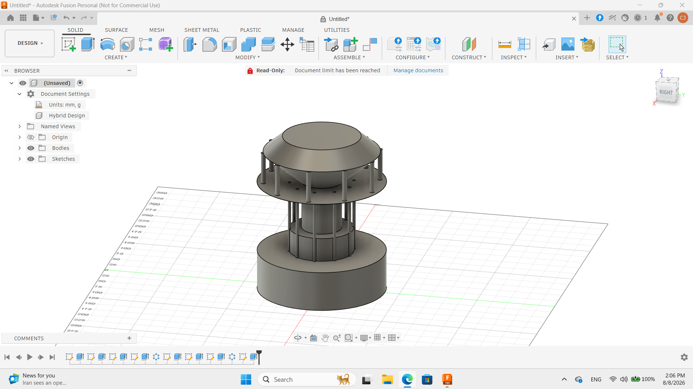

# 3D Modeling Projects — Fusion 360 Portfolio

  
  
<em>Parametric 3D designs created in Autodesk Fusion 360</em>

---

A collection of parametric 3D designs created in Autodesk Fusion 360, covering functional part design, assemblies, and real-world hardware projects.

## Designs

| # | Design | File | Description |
|---|--------|------|-------------|
| 1 | Cable Organizer | `cabel organizer.f3d` | Custom cable management solution for desk/workspace organization |
| 2 | Assembly of Different Parts | `assambly of differrent parts.f3z` | Multi-component assembly demonstrating constraint-based modeling |
| 3 | PSU Housing — Anycubic Kossel Linear Plus | `psu housing of anycibic kossel lienar plus_.f3z` | Replacement power supply housing for a 3D printer |

> **Note:** `.f3d` files are native Fusion 360 designs. `.f3z` files are Fusion 360 archives that preserve assembly relationships and external references.

## Skills Demonstrated

- **Parametric Modeling** — sketch-driven features with editable dimensions
- **Assembly Design** — multi-part assemblies with mates and constraints
- **Functional Part Design** — real-world hardware components (3D printer parts, organizers)
- **File Export** — STL/OBJ export for 3D printing

## Tools

- Autodesk Fusion 360 (Personal Use license)
- FDM 3D Printer (for physical validation)

## Author

**Aarya** — [GitHub Profile](https://github.com/<your-username>)
